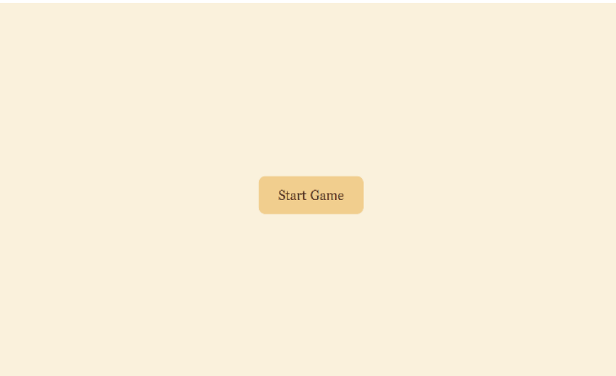
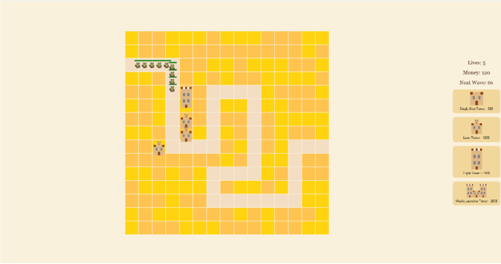
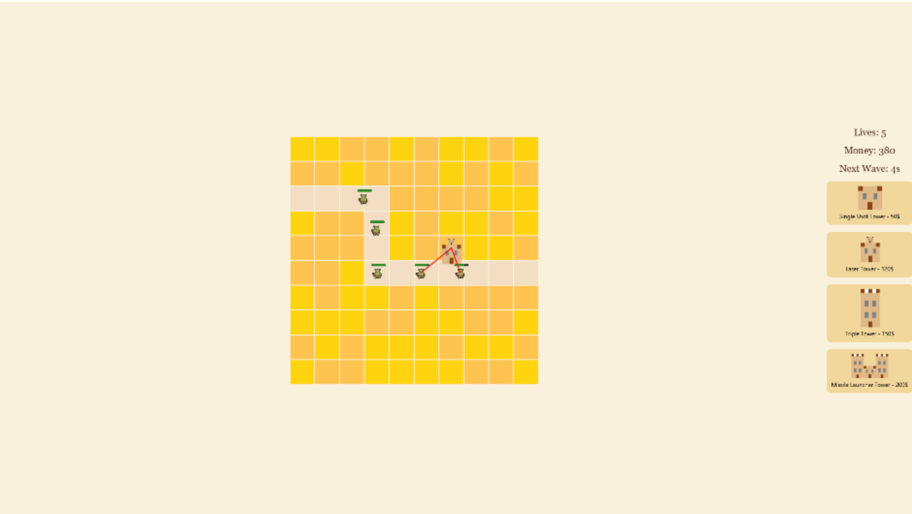
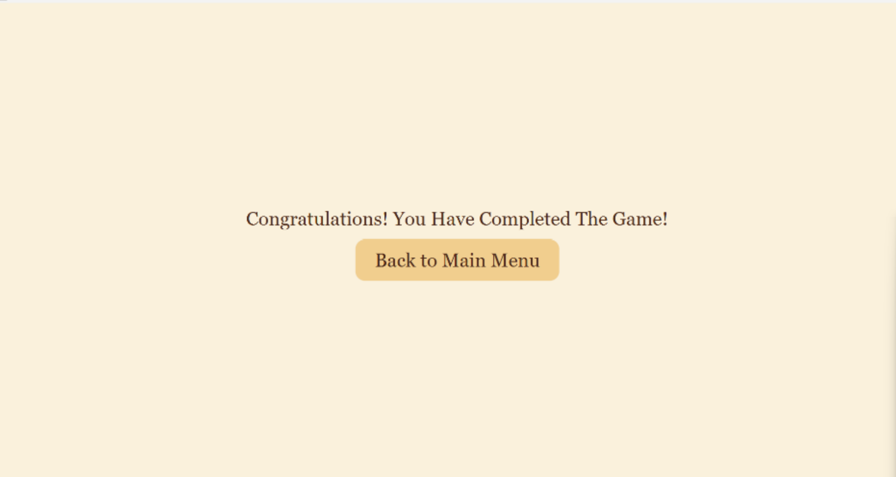

# 🏰 Tower Defense Game - JavaFX

A Tower Defense game developed in **Java** using **JavaFX** as part of a university group project.

The game features multiple levels, different tower types, enemy waves, and a strategic gameplay system where players defend the base by placing towers along enemy paths.

---

## 🎮 Features

- 5 playable levels
- Multiple enemy waves
- Four unique tower types
  - Single Shot Tower
  - Triple Shot Tower
  - Laser Tower
  - Missile Tower
- Drag & Drop tower placement
- Money and lives management
- Enemy health bars
- Projectile and explosion effects
- Level progression
- Game Over system

---

## 🛠 Technologies Used

- Java
- JavaFX
- Object-Oriented Programming (OOP)
- File Handling
- Event-Driven Programming

---

## 📁 Project Structure

```
src/
 ├── application/
 │   ├── Game.java
 │   ├── Enemy.java
 │   ├── Map.java
 │   ├── Wave.java
 │   ├── GameManager.java
 │   ├── TowerPlacementManager.java
 │   ├── TowerViewFactory.java
 │   ├── SingleShotTower.java
 │   ├── TripleShotTower.java
 │   ├── LaserTower.java
 │   └── MissileTower.java
```

---

## 🚀 How to Run

1. Install Java JDK.
2. Install JavaFX SDK.
3. Clone the repository.
4. Open the project in IntelliJ IDEA or Eclipse.
5. Configure JavaFX libraries.
6. Run the application.

---

## 📸 Screenshots

### Main Menu



---

### Gameplay



---

### Gameplay



---

### Game Over



---
